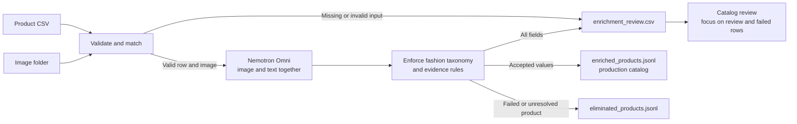

nvidia/nvidia/nemotron-3-ultra# Fashion Catalog Enrichment

## Purpose

This additive batch workflow turns a product CSV and matching image directory into a flat enriched fashion catalog. Nemotron Omni receives each complete CSV row and image together so visible evidence and supplied facts can be reconciled in one multimodal request.

The existing API and generic catalog-enrichment behavior are unchanged.

## Workflow



Omni reasons over the complete source row and image in one request. Deterministic validation then controls which values enter the production catalog. Confidence, provenance, unknown values, conflicts, and failures are written to the separate review report.

## Inputs

Required CSV columns:

| Column | Meaning |
|---|---|
| `name` | Product name |
| `description` | Original supplier or merchant description |
| `image` | Image path whose basename exists under `--images-dir` |
| `price` | Non-negative numeric price |

The current sample also provides `category`, `subcategory`, and `url`. All source columns are preserved. Version 0.1 supports one local image per row and does not download remote images.

### Example input dataset

The customer dataset is not distributed with this repository. A compatible input CSV has this shape:

```csv
category,subcategory,name,description,url,price,image
apparel,dress,Navy Wrap Dress,"A navy wrap dress made from 100% cotton with machine-wash care instructions.",https://shop.example/products/navy-wrap-dress,149.99,/images/navy_wrap_dress.jpg
footwear,shoes,Tan Lace-Up Boots,"Tan ankle boots with a leather upper and lace fastening.",https://shop.example/products/tan-boots,179.99,/images/tan_lace_up_boots.jpg
```

The matching image directory is supplied separately:

```text
images/
├── navy_wrap_dress.jpg
└── tan_lace_up_boots.jpg
```

Only the basename from the CSV `image` value is resolved beneath `--images-dir`. For example, `/images/navy_wrap_dress.jpg` resolves to `/path/passed/to/images/navy_wrap_dress.jpg`. Files are matched exactly; the workflow does not fuzzy-match names or silently substitute a different image.

CSV row numbers in the outputs include the header as row 1. In this example, the dress has `source_row=2` and the boots have `source_row=3`.

Additional customer columns are carried through to `enriched_products.jsonl`, but the current version expects the required column names shown above and does not yet support a column-mapping configuration.

## Configuration

Set `NGC_API_KEY` in the repository `.env`. By default, the workflow uses the VLM URL and model in `shared/config/config.yaml`. An OpenAI-compatible remote endpoint can be selected without editing YAML:

```bash
VLM_API_BASE_URL=https://integrate.api.nvidia.com/v1
VLM_MODEL=nvidia/nemotron-3-nano-omni-30b-a3b-reasoning
```

## Run

Validate inputs without model calls:

```bash
python -m backend.fashion.batch \
  --input-csv /path/to/products.csv \
  --images-dir /path/to/images \
  --output-dir /path/to/output \
  --validate-only
```

Enrich the catalog:

```bash
python -m backend.fashion.batch \
  --input-csv /path/to/products.csv \
  --images-dir /path/to/images \
  --output-dir /path/to/output \
  --locale en-US \
  --currency USD
```

## Output files

```text
output/
├── enriched_products.jsonl
├── eliminated_products.jsonl
├── enrichment_review.csv
├── batch_summary.json
└── run_manifest.json
```

### `enriched_products.jsonl`

This is the production catalog to ingest. Each line is one flat JSON product that passed the publication gate. It preserves every original CSV field, normalizes `category` and `subcategory`, adds accepted nonconflicting fashion attributes, and adds one grounded `enriched_description`.

| Field | Meaning |
|---|---|
| Original CSV fields | Preserved source values; normalized classification replaces source `category` and `subcategory` after successful enrichment |
| `record_id` | Existing product ID/SKU when supplied; otherwise a deterministic hash of source name, image, and URL |
| `source_row` | Original CSV row number, including the header as row 1 |
| `category` | Canonical broad category, such as `apparel`, `footwear`, `bags`, `eyewear`, or `jewelry` |
| `subcategory` | Canonical product class, such as `dresses`, `skirts`, `boots`, or `shoulder_bags` |
| Fashion attributes | Accepted applicable fields such as `primary_color`, `pattern`, `neckline`, `garment_length`, or `composition` |
| `description` | Original source description, unchanged |
| `enriched_description` | Natural description grounded in the image and trustworthy supplied facts; use this for semantic embedding and optional display |
| `currency` | Added only when `--currency` is supplied |

Unknown or inapplicable attribute values are omitted. A product with any unresolved image/text conflict is eliminated rather than published because the generated description may also contain the disputed fact. Confidence, provenance, statuses, conflicts, and processing details are intentionally excluded from this file.

Example:

```json
{
  "record_id": "generated:2b682a3db8471740",
  "source_row": 22,
  "category": "apparel",
  "subcategory": "dresses",
  "name": "Classic Wrap Dress",
  "description": "Original supplier description...",
  "price": "149.99",
  "image": "/images/wrap-dress.jpg",
  "primary_color": "navy",
  "neckline": "v_neck",
  "garment_length": "midi",
  "composition": "100% cotton",
  "enriched_description": "A navy midi dress with a V-neckline and wrap-style front. The supplied information identifies the fabric as 100% cotton."
}
```

The generated fallback ID is stable when the CSV is reordered, but a supplied `product_id`, `sku`, or `id` remains strongly preferred. If multiple rows share the same name and image without a stable supplied ID, all members of that ambiguous group are eliminated rather than assigned arbitrary identities.

### `eliminated_products.jsonl`

This is the quarantine file, not a production catalog. Each line preserves the original product, `record_id`, `source_row`, and an `elimination_reasons` array. A product is eliminated for:

- missing or unreadable required evidence;
- invalid required input;
- model enrichment that remains invalid after bounded retries;
- unresolved product classification or attribute evidence conflict;
- duplicate name/image identity without a stable source ID.

Fix or review these records, then rerun them before adding them to the production catalog.

### `enrichment_review.csv`

This is the human-readable audit and attention report. It contains one row per returned classification or attribute.

| Column | Meaning |
|---|---|
| `record_id` | Product identifier used in the enriched catalog |
| `source_row` | Original CSV row number |
| `product_name` | Source product name for convenient review |
| `field` | Classification, attribute, unsupported claim, image issue, or processing issue being reported |
| `original_value` | Relevant supplied value when available; blank when the field was newly extracted |
| `enriched_value` | Proposed normalized value; blank when unknown or failed |
| `confidence` | Model confidence that the value was extracted from the stated evidence; not scientific verification of a supplier claim |
| `provenance` | Evidence source or sources supporting the value |
| `status` | Whether the field is usable or needs attention |
| `attention_reason` | Plain-language reason for a conflict, unsupported claim, missing input, or processing failure |

Status definitions:

| Status | Meaning | Production behavior |
|---|---|---|
| `accepted` | Usable value supported by permitted evidence | Included in the JSONL when it is an attribute or classification |
| `review` | Conflict, unsupported claim, or material uncertainty requires attention | Disputed attribute is not promoted as trusted catalog data |
| `unknown` | Available evidence cannot establish the value; this is not an error | Omitted from the JSONL |
| `failed` | The row could not produce valid enrichment | Product is written to `eliminated_products.jsonl`, not the production JSONL |

Provenance definitions:

| Provenance | Meaning |
|---|---|
| `image` | Visible evidence from the product image |
| `source_text` | Evidence extracted from supplied name or description |
| `source_structured` | Evidence from a structured CSV field |
| `image_ocr` | Text visibly read from the image |
| Values joined with `+` | More than one source supports the value |

Accepted fields do not receive verbose generated reasoning. Their value, confidence, and provenance are the routine explanation. `attention_reason` is reserved for rows requiring action.

Example:

```csv
source_row,field,enriched_value,confidence,provenance,status,attention_reason
22,primary_color,navy,0.96,image,accepted,
22,composition,100% cotton,1.0,source_text,accepted,
22,garment_length,maxi,0.88,image,review,Source says midi but the visible garment appears maxi.
22,care,,0.0,,unknown,
```

## Validation and disposition rules

Validation occurs in three stages:

1. Input validation checks required text, price, image presence, and image readability.
2. Omni analyzes the complete CSV row and image together.
3. Deterministic validation enforces allowed classifications, applicable attributes, controlled values, evidence sources, and the required grounded description.

| Condition | Batch disposition | Review status and behavior |
|---|---|---|
| Valid input and enrichment with no material conflict | `PASS` | Accepted fields enter the JSONL |
| Optional attribute cannot be established | May remain `PASS` | Field is `unknown` and omitted from JSONL |
| Missing image | `REVIEW` | Product is eliminated because visual enrichment cannot run |
| Attribute text/image disagreement | `REVIEW` | Entire product is eliminated because generated prose may contain the disputed fact |
| Product-classification disagreement | `REVIEW` | Entire product is eliminated pending resolution |
| Unsupported objective claim | `REVIEW` | Claim is reported and excluded from grounded content |
| Duplicate name and image without stable source ID | `REVIEW` | All ambiguous rows are eliminated without model calls |
| Missing name or description | `FAIL` | `input_validation` is marked failed and product is eliminated |
| Invalid or negative price | `FAIL` | `input_validation` is marked failed and product is eliminated |
| Image exists but is unreadable | `FAIL` | `input_validation` is marked failed and product is eliminated |
| Model response remains invalid after three attempts | `FAIL` | `processing` is marked failed and product is eliminated |

Model output is rejected when it contains an unknown classification, an attribute that does not apply to the classification, a value outside a controlled vocabulary, invalid provenance, an image-only composition or care claim, or no grounded enriched description. Harmless structural variations are normalized before validation; invalid results receive at most three total attempts.

`PASS`, `REVIEW`, and `FAIL` apply to the complete product row in `batch_summary.json`. `accepted`, `review`, `unknown`, and `failed` apply to individual rows in `enrichment_review.csv`.

### `batch_summary.json`

Reports total, ready, eliminated, pass, review, fail, and skipped record counts. These are operational dispositions, not a composite truth or quality score.

### `run_manifest.json`

Records the input path and hash, image directory, taxonomy versions, locale, currency, validation mode, and execution time. It contains no credentials.

## Evidence rules

- Image evidence supports visible product form, color, pattern, neckline, sleeves, silhouette, and closure.
- Source text supports supplied nonvisual facts such as composition, care, and measurements.
- Structured fields support price, URL, identifiers, and other explicit source values.
- Appearance alone cannot prove composition, care, waterproofing, sustainability, measurements, availability, or performance.
- Text/image disagreements are reported rather than silently hidden.
- Unknown is preferred to guessing.

## Current limitations

- One local image per CSV row
- Default column names only
- Exact duplicate name/image ambiguity is quarantined; broader entity resolution and fuzzy duplicate detection are not included
- No style/variant reconstruction without stable identifiers
- No inventory or availability inference
- No Elasticsearch indexing or embedding generation
- No complete Google Merchant feed generation
- No large occasion, mood, aesthetic, or trend taxonomy
