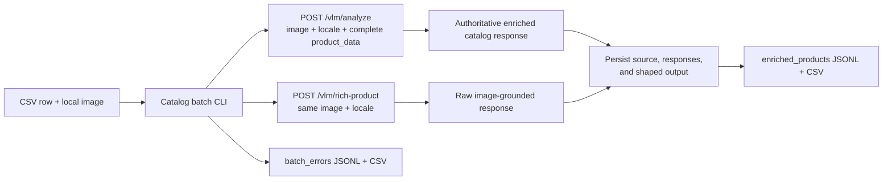

# Catalog Batch Client

The catalog batch client processes a CSV and matching local images through the existing catalog-enrichment API. It works for fashion and other product categories because it contains no model prompt, taxonomy, classification policy, or visual-evidence decision engine.

## Architecture



The running backend owns model configuration, prompts, model calls, response repair, and endpoint validation. The CLI owns only:

- CSV iteration and local image validation
- HTTP requests and bounded retries for transient failures
- row-level result and error persistence
- deterministic output shaping from the two endpoint responses

The CLI never imports an OpenAI client, reads an NGC key, or calls a NIM endpoint.

## Prerequisite

Start the backend normally so its existing configuration and credentials apply:

```bash
uvicorn --app-dir src backend.main:app --host 0.0.0.0 --port 8000
```

## Input

The CSV may contain any merchant fields. Every value is sent unchanged as part of `product_data`. By default, the `image` column identifies a file in `--images-dir`; only its basename is used.

Example input shape:

```csv
sku,name,description,category,price,image,merchant_attribute
SKU-100,Example Dress,Merchant-provided product description,dresses,79.00,/images/example-dress.jpg,merchant value
```

The only batch-specific requirement is a resolvable, readable image. Use `--image-column` if the CSV uses another column name. Product-field validation remains the responsibility of the API.

## Run

```bash
python -m backend.catalog_batch \
  --input-csv /path/to/products.csv \
  --images-dir /path/to/images \
  --output-dir /path/to/output \
  --api-base-url http://localhost:8000 \
  --locale en-US \
  --retries 2 \
  --timeout 120
```

Options:

| Option | Default | Meaning |
|---|---:|---|
| `--api-base-url` | `http://localhost:8000` | Base URL of the running catalog-enrichment backend |
| `--locale` | `en-US` | Locale forwarded unchanged to both endpoints |
| `--image-column` | `image` | CSV column containing the image path or URL |
| `--retries` | `2` | Additional attempts for network errors, HTTP 408/429, and HTTP 5xx |
| `--timeout` | `120` | Per-request timeout in seconds |

HTTP 4xx responses are not retried. In particular, the CLI does not replace or normalize an invalid locale; it records the API validation response as a row-level error.

## Endpoint requests

For every row whose local image passes validation, the CLI independently calls both endpoints.

`POST /vlm/analyze` receives:

- `image`: the product image
- `locale`: the CLI locale
- `product_data`: the complete CSV row serialized as JSON

`POST /vlm/rich-product` receives:

- `image`: the same product image
- `locale`: the same locale

Calling both independently means that a successful response is retained in the error record if the other endpoint fails.

## Output

### `enriched_products.jsonl` and `enriched_products.csv`

These contain one record for each row for which both endpoints succeeded:

| Field | Meaning |
|---|---|
| `record_id` | Source `product_id`, `sku`, or `id`; otherwise a stable hash of the complete source row |
| `source_row` | Original CSV line number, including the header as line 1 |
| `source` | Complete unmodified CSV row |
| `catalog_product` | Ingestible product shaped from the source and authoritative `/vlm/analyze` response |
| `enriched_response` | Complete `/vlm/analyze` response |
| `raw_product_response` | Complete `/vlm/rich-product` response |
| `visual_fields` | A convenience copy of selected raw fields, without reclassification or validation |
| `request_attempts` | HTTP attempts used by each endpoint; present in JSONL |

`catalog_product` begins with the source row, applies `enhanced_product` when returned, and then applies the endpoint's authoritative `title`, `description`, `categories`, `tags`, `colors`, `locale`, and policy decision. This preserves merchant-only fields while making the API result authoritative for enriched catalog fields.

For a fashion image, `visual_fields` may copy values such as `product_type`, `pattern`, visible colors, visible materials, and style directly from the raw response. These are evidence for downstream use—not a new controlled fashion taxonomy and not a second enrichment result.

Nested objects are JSON-encoded in the CSV version. The JSONL version retains native JSON objects and arrays.

### `batch_errors.jsonl` and `batch_errors.csv`

These contain row-level failures with:

- complete source row and CSV line number
- failure stage: `input_validation` or `endpoint_request`
- endpoint, HTTP status, and attempt count when applicable
- API or transport error message
- any successful response from the other endpoint

No failed row is written to `enriched_products`.

### Run metadata

- `batch_summary.json` records total, succeeded, and failed row counts.
- `run_manifest.json` records paths and CLI settings used for the run. It contains no model configuration because model configuration belongs to the backend.

## Fashion use

Fashion catalogs benefit from the same shared flow:

- merchant descriptions and private attributes travel in full through `/vlm/analyze`
- the enriched title and description come from the established backend behavior
- detailed visible garment characteristics remain available in `raw_product_response`
- commonly useful visual values are copied into `visual_fields` without inventing a separate ontology or confidence policy

If a future consumer needs a controlled fashion taxonomy, that should be added to the shared API contract or implemented as a separate downstream mapping owned by that consumer—not embedded as another model pipeline in this CLI.
