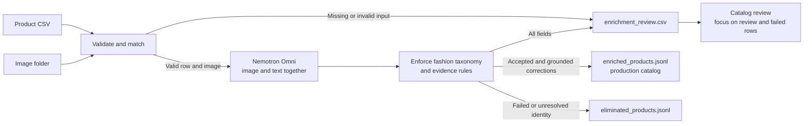

# Fashion Catalog Enrichment

## Purpose

This additive batch workflow turns a product CSV and matching image directory into a flat enriched fashion catalog. Nemotron Omni receives each complete CSV row and image together so visible evidence and supplied facts can be reconciled in one multimodal request.

The existing API and generic catalog-enrichment behavior are unchanged.

## Workflow



Omni reasons over the complete source row and image in one request. Deterministic validation then controls which values enter the production catalog. Confidence, provenance, unknown values, conflicts, and failures are written to the separate review report.

## How a product is represented

The workflow keeps four concerns separate so the production record stays useful without becoming a large, repetitive ontology.

### Product taxonomy — what is it?

One canonical category and subcategory identify the product:

```text
category: apparel
subcategory: dresses
```

This supports navigation, exact filtering, catalog consistency, and later channel export.

### Visual attribute vocabulary — what does it look like?

Only observable attributes that apply to the product type are added:

```text
primary_color: navy
pattern: floral
neckline: v_neck
sleeve_length: long
garment_length: midi
silhouette: a_line
```

A dress can have a neckline and sleeve length; a handbag cannot. Applicability rules prevent attributes from being attached to the wrong product type.

### Supplied product facts — what does the merchant know?

Facts that generally cannot be proven from appearance remain grounded in supplied data:

```text
composition: 100% cotton
care: machine wash cold
price: 149.99
```

### Grounded search description — how can it be found?

The workflow combines trustworthy supplied facts with visible characteristics into one natural description:

> A navy floral midi dress with a V-neckline, long sleeves, and an A-line silhouette, made from 100% cotton.

The taxonomy identifies the product, the visual vocabulary describes observable form, supplied facts preserve nonvisual specifications, and `enriched_description` supports semantic search.

## Inputs

Required CSV columns:

| Column | Meaning |
|---|---|
| `name` | Product name |
| `description` | Original supplier or merchant description |
| `image` | Image path whose basename exists under `--images-dir` |
| `price` | Non-negative numeric price |

Optional columns may include `sku`, `category`, `subcategory`, `url`, and any customer-specific fields. All source columns are preserved. Version 0.1 supports one local image per row and does not download remote images.

### Example input dataset

The examples below are fictional and self-contained. A compatible input CSV has this shape:

```csv
sku,category,subcategory,name,description,url,price,image
SKU-DRESS-001,apparel,dress,Navy Wrap Dress,"A navy wrap dress made from 100% cotton with machine-wash care instructions.",https://shop.example/products/navy-wrap-dress,149.99,/images/navy_wrap_dress.jpg
SKU-BOOT-001,footwear,shoes,Tan Lace-Up Boots,"Tan ankle boots with a leather upper and lace fastening.",https://shop.example/products/tan-boots,179.99,/images/tan_lace_up_boots.jpg
```

The matching image directory is supplied separately:

```text
images/
├── navy_wrap_dress.jpg
└── tan_lace_up_boots.jpg
```

Only the basename from the CSV `image` value is resolved beneath `--images-dir`. For example, `/images/navy_wrap_dress.jpg` resolves to `/path/passed/to/images/navy_wrap_dress.jpg`. Files are matched exactly; the workflow does not fuzzy-match names or silently substitute a different image.

CSV row numbers in the outputs include the header as row 1. In this example, the dress has `source_row=2` and the boots have `source_row=3`.

Additional customer columns are carried through to `enriched_products.jsonl`, but the current version expects the required column names shown above and does not yet support a column-mapping configuration.

## Configuration

Set `NGC_API_KEY` in the repository `.env`. By default, the workflow uses the VLM URL and model in `shared/config/config.yaml`. An OpenAI-compatible remote endpoint can be selected without editing YAML:

```bash
VLM_API_BASE_URL=https://integrate.api.nvidia.com/v1
VLM_MODEL=nvidia/nemotron-3-nano-omni-30b-a3b-reasoning
```

## Run

Validate inputs without model calls:

```bash
python -m backend.fashion.batch \
  --input-csv /path/to/products.csv \
  --images-dir /path/to/images \
  --output-dir /path/to/output \
  --validate-only
```

Enrich the catalog:

```bash
python -m backend.fashion.batch \
  --input-csv /path/to/products.csv \
  --images-dir /path/to/images \
  --output-dir /path/to/output \
  --locale en-US \
  --currency USD
```

## Output files

```text
output/
├── enriched_products.jsonl
├── eliminated_products.jsonl
├── enrichment_review.csv
├── batch_summary.json
└── run_manifest.json
```

### `enriched_products.jsonl`

This is the production catalog to ingest. Each line is one flat JSON product that passed the publication gate. It preserves every original CSV field, normalizes `category` and `subcategory`, adds accepted or visually corrected fashion attributes, and adds one grounded `enriched_description`.

| Field | Meaning |
|---|---|
| Original CSV fields | Preserved source values; normalized classification replaces source `category` and `subcategory` after successful enrichment |
| `record_id` | Existing product ID/SKU when supplied; otherwise a deterministic hash of source name, image, and URL |
| `source_row` | Original CSV row number, including the header as row 1 |
| `category` | Canonical broad category, such as `apparel`, `footwear`, `bags`, `eyewear`, or `jewelry` |
| `subcategory` | Canonical product class, such as `dresses`, `skirts`, `boots`, or `shoulder_bags` |
| Fashion attributes | Accepted applicable fields such as `primary_color`, `pattern`, `neckline`, `garment_length`, or `composition` |
| `description` | Original source description, unchanged |
| `enriched_description` | Natural description grounded in the image and trustworthy supplied facts; use this for semantic embedding and optional display |
| `currency` | Added only when `--currency` is supplied |

Unknown or inapplicable attribute values are omitted. A clear conflict about a visible attribute does not eliminate the product: the visible value is published, the contradicted claim is excluded from `enriched_description`, and the complete decision is recorded in `enrichment_review.csv`. An unresolved product-identity conflict still eliminates the product. Confidence, provenance, statuses, conflicts, and processing details are intentionally excluded from this ingestion file.

Example:

```json
{
  "record_id": "SKU-DRESS-001",
  "source_row": 2,
  "category": "apparel",
  "subcategory": "dresses",
  "name": "Navy Wrap Dress",
  "description": "A navy wrap dress made from 100% cotton with machine-wash care instructions.",
  "url": "https://shop.example/products/navy-wrap-dress",
  "price": "149.99",
  "image": "/images/navy_wrap_dress.jpg",
  "primary_color": "navy",
  "neckline": "v_neck",
  "garment_length": "midi",
  "composition": "100% cotton",
  "care": "machine_wash",
  "enriched_description": "A navy cotton midi dress with a V-neckline and wrap-style front. Supplied care instructions specify machine washing."
}
```

This is the enriched form of the fictional first CSV row shown under **Example input dataset**. The example uses a supplied SKU as `record_id`; if no stable ID column is present, the workflow generates a deterministic fallback ID.

The generated fallback ID is stable when the CSV is reordered, but a supplied `product_id`, `sku`, or `id` remains strongly preferred. If multiple rows share the same name and image without a stable supplied ID, all members of that ambiguous group are eliminated rather than assigned arbitrary identities.

### `eliminated_products.jsonl`

This is the quarantine file, not a production catalog. Each line preserves the original product and adds:

| Field | Meaning |
|---|---|
| `record_id` | Supplied stable ID or deterministic fallback ID |
| `source_row` | Original CSV row number |
| `elimination_reasons` | Stable machine-readable reason codes |
| `elimination_explanations` | Product-specific plain-language explanations, including the conflicting field and evidence reason when available |

For a blocking identity conflict, the explanation states:

1. which field caused elimination;
2. what the input text or structured row claimed;
3. what visual analysis found;
4. why the workflow refused to publish an unresolved choice.

Example:

```json
{
  "record_id": "SKU-SHOE-001",
  "source_row": 2,
  "category": "footwear",
  "subcategory": "flats",
  "name": "Velvet Ballet Flats",
  "description": "Closed-toe velvet ballet flats with a low-profile sole.",
  "price": "89.99",
  "image": "/images/velvet_ballet_flats.jpg",
  "elimination_reasons": ["UNRESOLVED_PRODUCT_CLASSIFICATION"],
  "elimination_explanations": [
    "Cause: input-text-versus-image conflict for 'category/subcategory'. Input text/structured data says 'ballet flats'; visual analysis says 'high-heeled pumps'. Evidence detail: the source describes a low-profile flat, while the image shows a pointed stiletto heel. The product was not published because choosing either value without review could make its taxonomy, filters, or enriched description incorrect."
  ]
}
```

The opening `Cause:` label makes the evidence path explicit. It will say whether the failure is an unresolved identity conflict, missing or unusable visual evidence, incomplete or invalid input data, ambiguous product identity, model-output validation failure, or incomplete enrichment. Attribute corrections belong in the review report, not the eliminated file.

### When a product is eliminated

| Condition | Why it cannot enter the production JSONL |
|---|---|
| Required name or description is missing | The product cannot be identified or described reliably |
| Price is invalid or negative | The source record fails the required input contract |
| Image is missing or unreadable | Joint image/text enrichment cannot be completed |
| Model output remains invalid after three corrective attempts | No schema-valid, taxonomy-valid enrichment is available |
| Source and image disagree on product classification | Publishing either classification would silently resolve an unresolved identity conflict |
| Multiple rows share name and image without stable IDs | The workflow cannot safely determine whether they are duplicates, variants, or distinct products |

Unknown optional attributes, corrected visible attributes, and unsupported source claims do **not** eliminate a product when the workflow can produce internally consistent grounded content. A product is eliminated only when its identity is unresolved, required evidence or input is unavailable, or no valid enrichment can be produced.

Machine-readable elimination codes include:

- `MISSING_REQUIRED_FIELD`
- `INVALID_PRICE`
- `IMAGE_NOT_FOUND`
- `IMAGE_UNREADABLE`
- `MODEL_ENRICHMENT_FAILED`
- `UNRESOLVED_PRODUCT_CLASSIFICATION`
- `DUPLICATE_NAME_IMAGE`

Fix or review these records, then rerun them before adding them to the production catalog.

### `enrichment_review.csv`

This is the human-readable audit and attention report. It contains one row per returned classification or attribute.

| Column | Meaning |
|---|---|
| `record_id` | Product identifier used in the enriched catalog |
| `source_row` | Original CSV row number |
| `product_name` | Source product name for convenient review |
| `field` | Classification, attribute, unsupported claim, image issue, or processing issue being reported |
| `original_value` | Relevant supplied value when available; blank when the field was newly extracted |
| `enriched_value` | Proposed normalized value; blank when unknown or failed |
| `confidence` | Model confidence that the value was extracted from the stated evidence; not scientific verification of a supplier claim |
| `provenance` | Evidence source or sources supporting the value |
| `status` | Whether the field is usable or needs attention |
| `attention_reason` | Plain-language reason for a conflict, unsupported claim, missing input, or processing failure |
| `decision` | Explicit publication choice, such as `accepted`, `published_with_visual_correction`, `published_after_model_retry`, `published_after_recovery_run`, `claim_omitted`, or a value/correction not published because the product was eliminated |
| `decision_reason` | Why that choice was safe, including which evidence was authoritative |

Status definitions:

| Status | Meaning | Production behavior |
|---|---|---|
| `accepted` | Usable value supported by permitted evidence | Included in the JSONL when it is an attribute or classification |
| `corrected` | Source text clearly conflicts with a directly visible attribute | Visual value is included in the JSONL and the source claim is excluded from the enriched description |
| `review` | Unsupported claim, identity conflict, or material uncertainty requires attention | Behavior is stated explicitly in `decision` |
| `unknown` | Available evidence cannot establish the value; this is not an error | Omitted from the JSONL |
| `failed` | The row could not produce valid enrichment | Product is written to `eliminated_products.jsonl`, not the production JSONL |

### Generic status examples

These fictional, self-contained examples are adapted from validation behaviors; no external catalog or test output is required to understand them. `status` describes the field finding; `decision` records what the workflow did with it.

| Example product | Field result | Status | Decision | Meaning |
|---|---|---|---|---|
| Gold-tone bracelet | `metal_color=gold_tone`, confidence `0.97`, provenance `image` | `accepted` | `accepted` | The supported value is published |
| Red heeled sandal | Supplied text says `closed_toe`; the product is visibly `open_toe`, confidence `0.99`, provenance `image+source_text` | `corrected` | `published_with_visual_correction` | The structured product and grounded description use `open_toe`; the inconsistency remains visible in review |
| Bracelet without supplied care instructions | `care` has no supported value | `unknown` | `omitted_not_available` | Care is omitted without blocking the bracelet |
| Crystal bracelet with an unverified quality claim | Unsupported claim: `high-quality crystals` | `review` | `claim_omitted` | The claim is excluded, but the remaining bracelet is published |
| Footwear described as ballet flats but visibly constructed as stiletto heels | Supplied identity and visible product type disagree | `review` | `eliminated_for_identity_review` | The complete product is withheld because its identity is contradictory |
| The same identity-blocked footwear | `heel_type: low-profile → stiletto`, confidence `0.99`, provenance `image` | `corrected` | `correction_not_published` | The visual finding is recorded, but no field is published because the complete product remains blocked |
| Skirt whose referenced image file is absent | Image cannot be loaded | `review` | `eliminated_for_missing_visual_evidence` | Multimodal enrichment cannot run, so the product is withheld |
| Sunglasses whose first model response tries to replace supplied composition using appearance | Invalid response is rejected; a corrected retry preserves the supplied composition | `review` | `published_after_model_retry` | The valid later response is published and the rejected attempt remains visible in review |

The important distinction is that `review` does not automatically mean elimination. An unsupported claim may be omitted while the product is published; an unresolved identity conflict eliminates the complete product. Likewise, a `corrected` field is published only when the product itself passes the publication gate.

Provenance definitions:

| Provenance | Meaning |
|---|---|
| `image` | Visible evidence from the product image |
| `source_text` | Evidence extracted from supplied name or description |
| `source_structured` | Evidence from a structured CSV field |
| `image_ocr` | Text visibly read from the image |
| Values joined with `+` | More than one source supports the value |

Accepted fields do not receive verbose generated reasoning. Their value, confidence, and provenance are the routine explanation. `attention_reason` is reserved for rows requiring action.

Illustrative review excerpt showing both the inconsistency and the publication decision. Assume CSV row 2 is a fictional red heeled sandal whose supplied description says it is closed-toe while its image clearly shows an open toe:

```csv
source_row,field,original_value,enriched_value,confidence,provenance,status,attention_reason,decision,decision_reason
2,primary_color,,red,0.96,image,accepted,,accepted,The value passed taxonomy and evidence validation.
2,heel_type,,stiletto,0.98,image,accepted,,accepted,The value passed taxonomy and evidence validation.
2,toe_shape,closed_toe,open_toe,0.99,image+source_text,corrected,Source says closed-toe but the image clearly shows an open toe.,published_with_visual_correction,The attribute is directly visible so the visual value replaced the source value in the product and enriched description.
2,care,,,0.0,,unknown,,omitted_not_available,No sufficiently supported value was available so the attribute was omitted without blocking the product.
```

### Decision reference

`status` describes the field finding. `decision` states what the workflow did with that finding. The decision is the clearest column for determining whether a value or product was published.

| Decision | Example situation | Outcome | Relevant output |
|---|---|---|---|
| `accepted` | A visible color is supported by the image and passes the controlled vocabulary | Value is published | `enriched_products.jsonl`; evidence row in `enrichment_review.csv` |
| `published_with_visual_correction` | Supplied text says `closed_toe`; clear visual evidence says `open_toe` | Visual value and corrected description are published; inconsistency and rationale remain in review | `enriched_products.jsonl` and `enrichment_review.csv` |
| `omitted_not_available` | Care instructions are absent and cannot be established visually | Optional field is omitted; product remains publishable | `enrichment_review.csv` |
| `claim_omitted` | Supplied text makes an objective claim that available evidence cannot support | Claim is excluded from grounded enrichment; remaining product is published | `enriched_products.jsonl` and `enrichment_review.csv` |
| `published_after_model_retry` | An earlier model response violates an evidence or schema rule, and a later response corrects it | Invalid response is discarded; the valid product is published with the earlier error recorded for audit | `enriched_products.jsonl` and `enrichment_review.csv` |
| `published_after_recovery_run` | The initial batch exhausts its bounded attempts, but an independently rerun processing failure later passes every publication rule | Valid recovery result is published; the original processing error and final recovery decision remain in review | `enriched_products.jsonl` and `enrichment_review.csv` |
| `eliminated_for_identity_review` | Supplied identity says flats while clear visual evidence identifies heels, or duplicate rows lack stable IDs | Entire product is withheld because its identity is unresolved | `eliminated_products.jsonl` and `enrichment_review.csv` |
| `correction_not_published` | A visual attribute correction exists, but the same product has a blocking identity conflict | Correction is recorded for review but is not published | `eliminated_products.jsonl` and `enrichment_review.csv` |
| `value_not_published` | An individual field is valid, but the product has a blocking identity conflict | Valid field is recorded but is not published independently | `eliminated_products.jsonl` and `enrichment_review.csv` |
| `claim_not_published` | An unsupported claim belongs to a product already blocked by an identity conflict | Claim and product both remain outside the production catalog | `eliminated_products.jsonl` and `enrichment_review.csv` |
| `eliminated_for_missing_visual_evidence` | Referenced image is missing or unusable | Product is withheld because multimodal enrichment cannot run | `eliminated_products.jsonl` and `enrichment_review.csv` |
| `eliminated_for_invalid_input` | Required name/description is missing or price is invalid | Product fails the input contract and is withheld | `eliminated_products.jsonl` and `enrichment_review.csv` |
| `eliminated_for_processing_failure` | Model output remains schema- or taxonomy-invalid after three corrective attempts | Product is withheld with the exact final validation detail | `eliminated_products.jsonl` and `enrichment_review.csv` |

Example of a published correction:

```text
field: toe_shape
original_value: closed_toe
enriched_value: open_toe
status: corrected
decision: published_with_visual_correction
attention_reason: Supplied text says closed-toe while the product is visibly open-toe.
decision_reason: The directly visible value replaced the conflicting source value in the product and enriched description.
```

Example of an identity-blocked product with otherwise valid field findings:

```text
category/subcategory decision: eliminated_for_identity_review
heel_type decision: correction_not_published
primary_color decision: value_not_published
result: the complete product is written only to eliminated_products.jsonl
```

## Validation and disposition rules

Validation occurs in three stages:

1. Input validation checks required text, price, image presence, and image readability.
2. Omni analyzes the complete CSV row and image together.
3. Deterministic validation enforces allowed classifications, applicable attributes, controlled values, evidence sources, and the required grounded description. When a response is invalid, the exact errors and prior multimodal result are supplied to a text-only repair attempt. The image is not resent during repair, so valid visual findings can be preserved without encouraging another visual inference about nonvisual facts.

| Condition | Batch disposition | Review status and behavior |
|---|---|---|
| Valid input and enrichment with no material conflict | `PASS` | Accepted fields enter the JSONL |
| Optional attribute cannot be established | May remain `PASS` | Field is `unknown` and omitted from JSONL |
| Missing image | `REVIEW` | Product is eliminated because visual enrichment cannot run |
| Clear visible-attribute disagreement | `REVIEW` | Product is published with the visual correction; source value, visual value, inconsistency, decision, and rationale are recorded |
| Product-classification disagreement | `REVIEW` | Entire product is eliminated pending resolution |
| Unsupported objective claim | `REVIEW` | Claim is reported and excluded from grounded content; the remaining product is published |
| Duplicate name and image without stable source ID | `REVIEW` | All ambiguous rows are eliminated without model calls |
| Missing name or description | `FAIL` | `input_validation` is marked failed and product is eliminated |
| Invalid or negative price | `FAIL` | `input_validation` is marked failed and product is eliminated |
| Image exists but is unreadable | `FAIL` | `input_validation` is marked failed and product is eliminated |
| An invalid model response is corrected by a later retry | `REVIEW` | Product is published; `processing` records `published_after_model_retry` and the rejected validation error |
| A processing-only failure passes an independently executed recovery run | `REVIEW` | Product is published; the initial error is retained with `published_after_recovery_run` |
| Model response remains invalid after three corrective attempts | `FAIL` | `processing` is marked failed and product is eliminated |

Model output is rejected when it contains an unknown classification, an attribute that does not apply to the classification, a value outside a controlled vocabulary, invalid provenance, an image-only composition or care claim, an incomplete conflict record, a visual correction that does not match the selected attribute, or no grounded enriched description. Every response must explicitly assess `composition` and `care`: use a supplied value with text or structured provenance, or mark the field unknown. This prevents the description from silently introducing material or care claims from appearance. Harmless structural variations are normalized before validation; invalid results receive at most three total attempts.

`PASS`, `REVIEW`, and `FAIL` apply to the complete product row in `batch_summary.json`. `accepted`, `review`, `unknown`, and `failed` apply to individual rows in `enrichment_review.csv`.

### `batch_summary.json`

Reports total, ready, eliminated, pass, review, fail, and skipped record counts. These are operational dispositions, not a composite truth or quality score.

### `run_manifest.json`

Records the input path and hash, image directory, taxonomy versions, locale, currency, validation mode, and execution time. It contains no credentials.

## Evidence rules

- Image evidence supports visible product form, color, pattern, neckline, sleeves, silhouette, and closure.
- Source text supports supplied nonvisual facts such as composition, care, and measurements.
- Source text also supports hidden or internal functional features that one exterior image cannot confirm or refute.
- Structured fields support price, URL, identifiers, and other explicit source values.
- Appearance alone cannot prove composition, care, waterproofing, sustainability, measurements, availability, or performance.
- Composition and care are always assessed explicitly. When absent from supplied data they are marked unknown and omitted from the production JSONL.
- A conflict requires clear, mutually exclusive evidence about the same attribute and product component.
- Layered product components may coexist; seeing one exterior closure does not disprove a supplied hidden or internal closure.
- A product may support multiple carrying methods; one photographed presentation does not disprove a supplied detachable or out-of-frame strap.
- Lack of visibility or visual uncertainty is not a conflict.
- Clear visible-attribute conflicts use the visual correction in structured data and grounded description while retaining the complete audit decision in the review report.
- Product-identity conflicts are reported and eliminated rather than silently resolved.
- Unknown is preferred to guessing.

## Current limitations

- One local image per CSV row
- Default column names only
- Exact duplicate name/image ambiguity is quarantined; broader entity resolution and fuzzy duplicate detection are not included
- No style/variant reconstruction without stable identifiers
- No inventory or availability inference
- No Elasticsearch indexing or embedding generation
- No complete Google Merchant feed generation
- No large occasion, mood, aesthetic, or trend taxonomy
